# Лабораторная работа №6: Управление взаимодействием контейнеров

---

## Студент

- **Имя и фамилия**: Никита Савка  
- **Группа**: I2302  
- **Платформа**: macOS (Apple M3)  
- **Дата выполнения**: 5 марта 2025  

---

## Цель работы

Научиться управлять взаимодействием нескольких Docker-контейнеров через создание **PHP-приложения**, работающего на базе двух контейнеров:  
- **Nginx** — обработка HTTP-запросов.  
- **PHP-FPM** — выполнение PHP-кода.  
Особенности: монтирование файлов сайта и конфигурации Nginx из локальной директории, использование пользовательской сети для связи контейнеров.

---

## Задачи

1. Создать и склонировать репозиторий `containers06`.  
2. Подготовить структуру для сайта в `mounts/site` и перенести PHP-код.  
3. Настроить `.gitignore` для исключения файлов сайта.  
4. Создать конфигурацию Nginx (`default.conf`) для работы с PHP-FPM.  
5. Настроить сеть `internal` для взаимодействия контейнеров.  
6. Запустить контейнер `backend` (PHP-FPM) с монтированием сайта.  
7. Запустить контейнер `frontend` (Nginx) с пробросом порта и монтированием конфигурации.  
8. Проверить работу сайта на `http://localhost`.  
9. Ответить на вопросы о взаимодействии контейнеров.  

---

## Ход выполнения

### 1. Подготовка репозитория

#### Шаги:  
1. **Создание репозитория**:  
   - Создал публичный репозиторий `containers06` на GitHub: [https://github.com/NikitaBytes/containers06](https://github.com/NikitaBytes/containers06).  
   - **Скриншот**: Создание  
     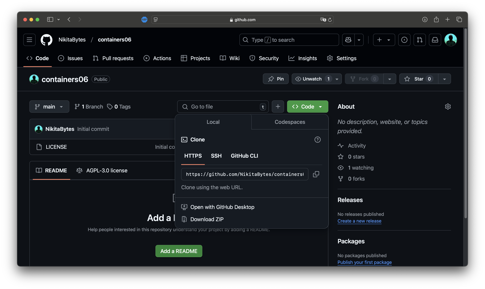  

2. **Клонирование**:  
   - Выполнил:  
     ```bash
     cd ~/Projects
     git clone https://github.com/NikitaBytes/containers06.git
     cd containers06
     ```  
   - **Скриншот**: Клонирование  
     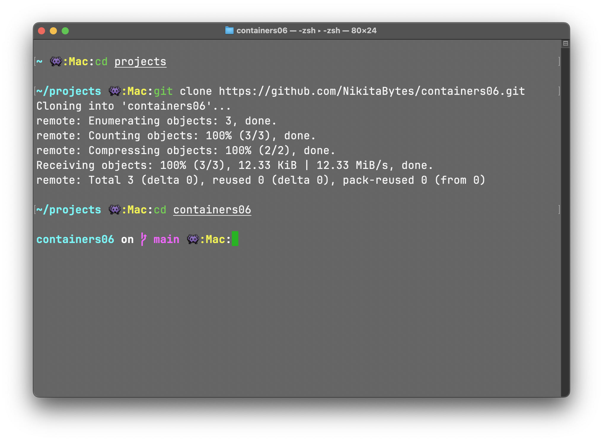  

#### Итог:  
Репозиторий готов для работы.  

---

### 2. Создание структуры проекта

#### Шаги:  
1. **Директория сайта**:  
   - Создал:  
     ```bash
     mkdir -p mounts/site
     ```  
   - Скопировал PHP-сайт:  
     ```bash
     cp -r /Users/nikita_a/Downloads/PHP/lab3_arrays_functions/index.php mounts/site/
     ```  
   - **Скриншот**: Содержимое  
     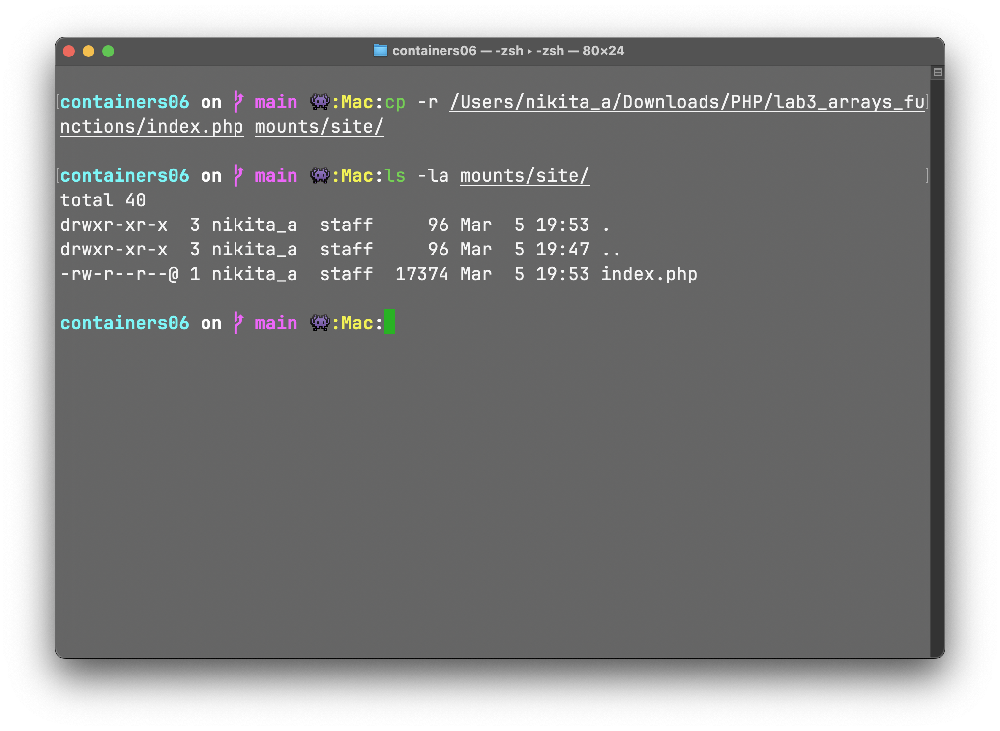  

2. **Настройка `.gitignore`**:  
   - Выполнил:  
     ```bash
     touch .gitignore
     echo "mounts/site/*" >> .gitignore
     git add .gitignore
     git commit -m "Добавлен .gitignore для исключения сайта"
     git push origin main
     ```  
   - **Скриншот**: Редактирование  
     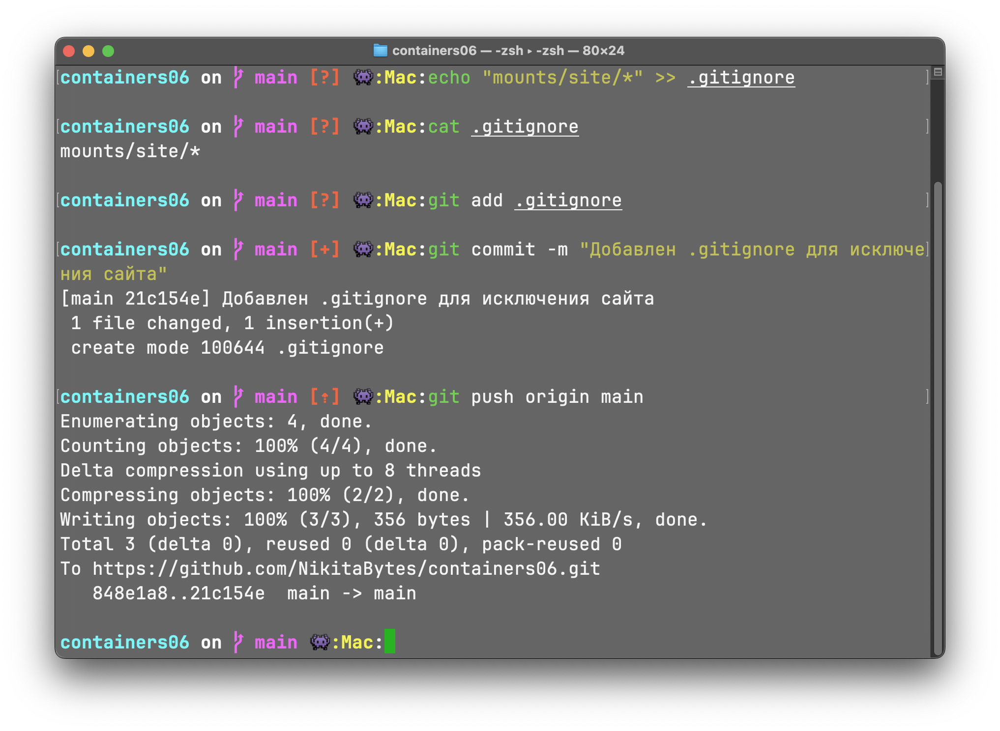  

#### Итог:  
Структура создана, файлы сайта исключены из репозитория.  

---

### 3. Конфигурация Nginx

#### Шаги:  
1. **Создание директории**:  
   ```bash
   mkdir -p nginx
   ```  

2. **Файл `default.conf`**:  
   - Создал и добавил:  
     ```nginx
     server {
         listen 80;
         server_name _;
         root /var/www/html;
         index index.php;

         location / {
             try_files $uri $uri/ /index.php?$args;
         }

         location ~ \.php$ {
             fastcgi_pass backend:9000;
             fastcgi_index index.php;
             fastcgi_param SCRIPT_FILENAME $document_root$fastcgi_script_name;
             include fastcgi_params;
         }
     }
     ```  
   - **Разбор**:  
     - `root /var/www/html` — корень сайта.  
     - `fastcgi_pass backend:9000` — перенаправление PHP-запросов на контейнер `backend`.  
     - `include fastcgi_params` — стандартные параметры FastCGI.  
  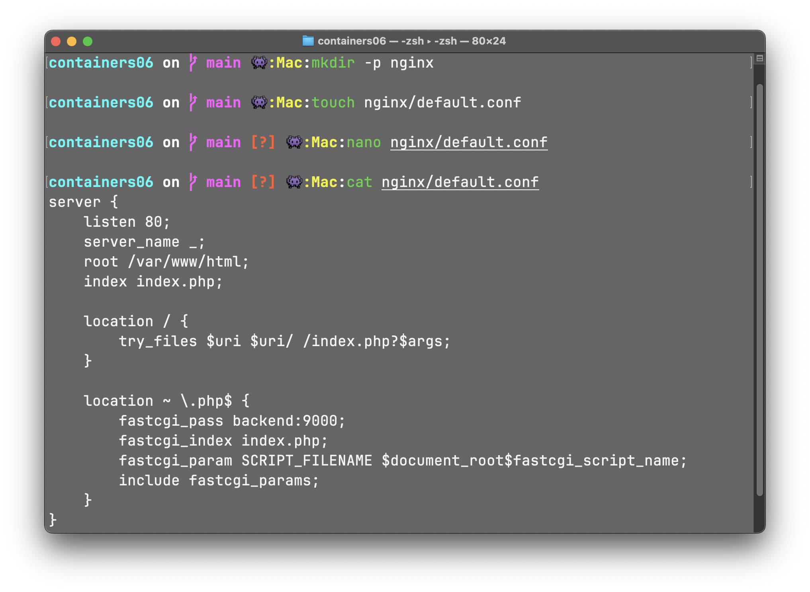

3. **Добавление в Git**:  
   ```bash
   git add nginx/default.conf
   git commit -m "Добавлен конфигурационный файл Nginx"
   git push origin main
   ```  

#### Итог:  
Конфигурация Nginx готова для интеграции с PHP-FPM.  

---

### 4. Создание сети

#### Шаги:  
1. **Создание сети**:  
   ```bash
   docker network create internal
   ```  

2. **Проверка**:  
   ```bash
   docker network ls
   ```  
   - **Скриншот**: Список сетей и создание 
     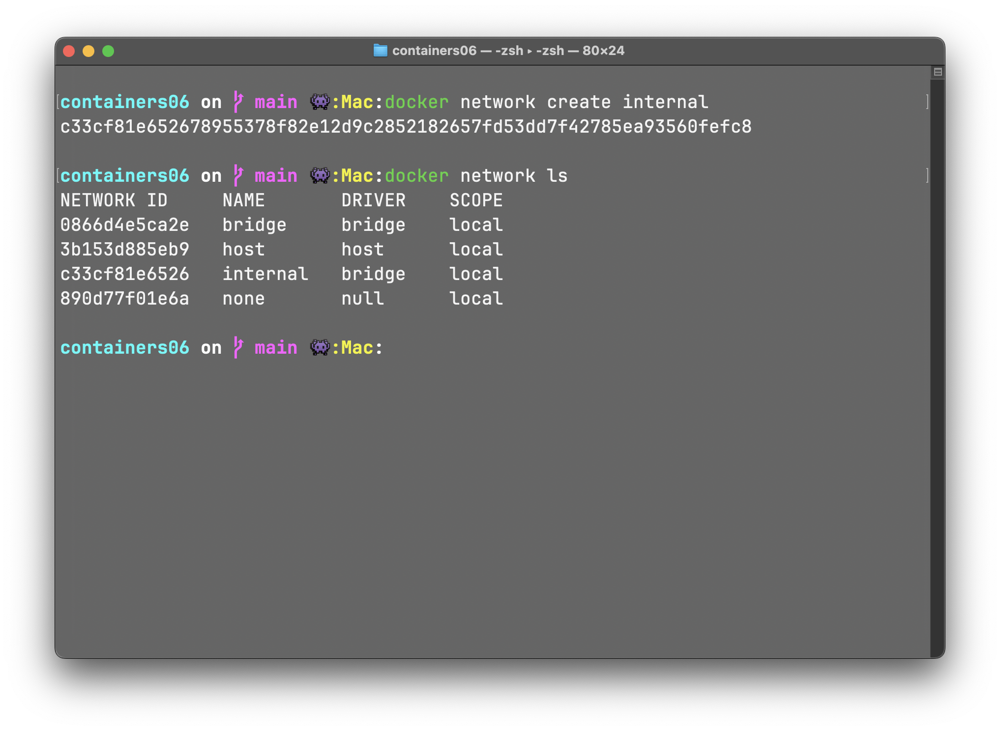  

#### Итог:  
Сеть `internal` создана для связи контейнеров.  

---

### 5. Запуск контейнера `backend` (PHP-FPM)

#### Шаги:  
1. **Команда**:  
   ```bash
   docker run -d \
       --name backend \
       --network internal \
       -v $(pwd)/mounts/site:/var/www/html \
       php:7.4-fpm
   ```  
   - **Разбор**:  
     - `docker run -d` — запускает контейнер в фоновом режиме.  
     - `--name backend` — назначает имя контейнеру backend.
     - `php:7.4-fpm` — использует официальный образ PHP 7.4 с FPM.  
     - `--network internal` — подключает контейнер к сети internal, чтобы он мог взаимодействовать с frontend.  
     - `-v ...` — монтирует локальную директорию mounts/site внутрь контейнера в /var/www/html, чтобы сайт был доступен внутри контейнера.  

2. **Проверка**:  
   ```bash
   docker ps
   ```  
   - **Скриншот**: Статус  
     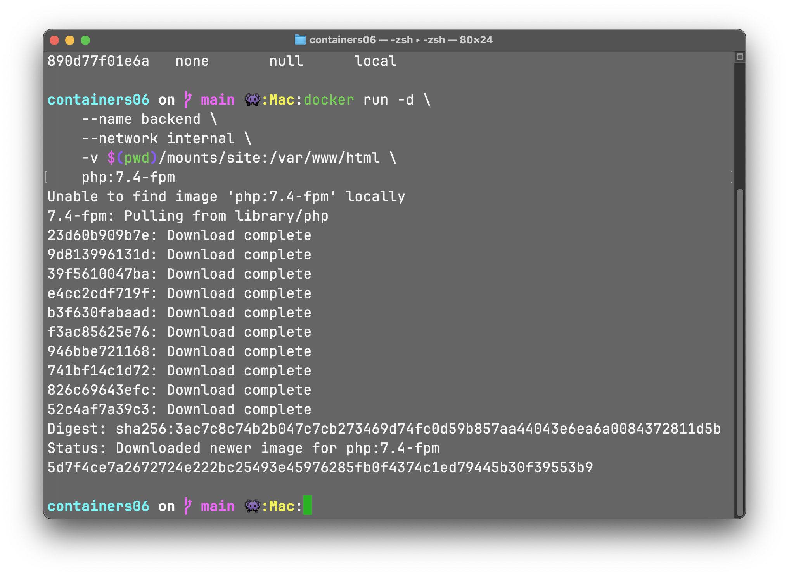  
     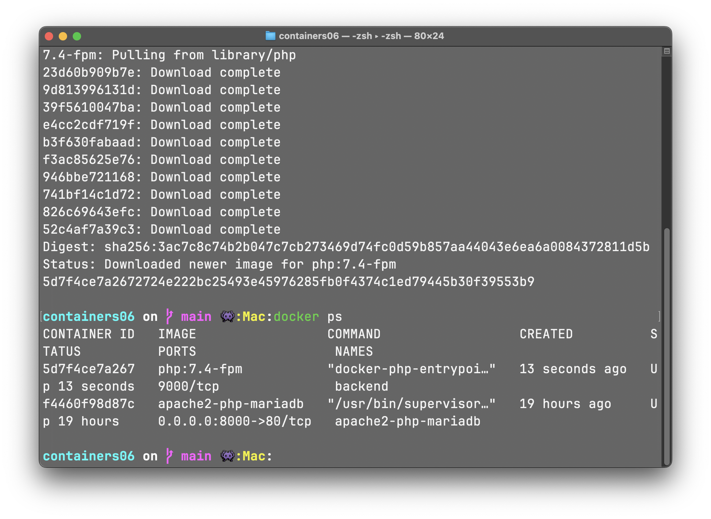

#### Итог:  
Контейнер `backend` запущен и готов выполнять PHP-код.  

---

### 6. Запуск контейнера `frontend` (Nginx)

#### Шаги:  
1. **Команда**:  
   ```bash
   docker run -d \
       --name frontend \
       --network internal \
       -v $(pwd)/mounts/site:/var/www/html \
       -v $(pwd)/nginx/default.conf:/etc/nginx/conf.d/default.conf \
       -p 80:80 \
       nginx:1.23-alpine
   ```  
   - **Разбор**:  
     - `docker run -d` — запускает контейнер в фоновом режиме.
     - `--name frontend` — назначает имя контейнеру frontend.
     - `--network internal` — подключает контейнер к сети internal, чтобы он мог взаимодействовать с backend.
     - `nginx:1.23-alpine` — использует официальный легковесный образ Nginx 1.23.
     - `-p 80:80` — открывает порт 80 на локальном хосте.  
     - Два `-v` — монтирует локальные директории mounts/site и nginx/default.conf внутрь контейнера.  

2. **Проверка**:  
   ```bash
   docker ps
   ```  
   - **Скриншот**: Статус  
     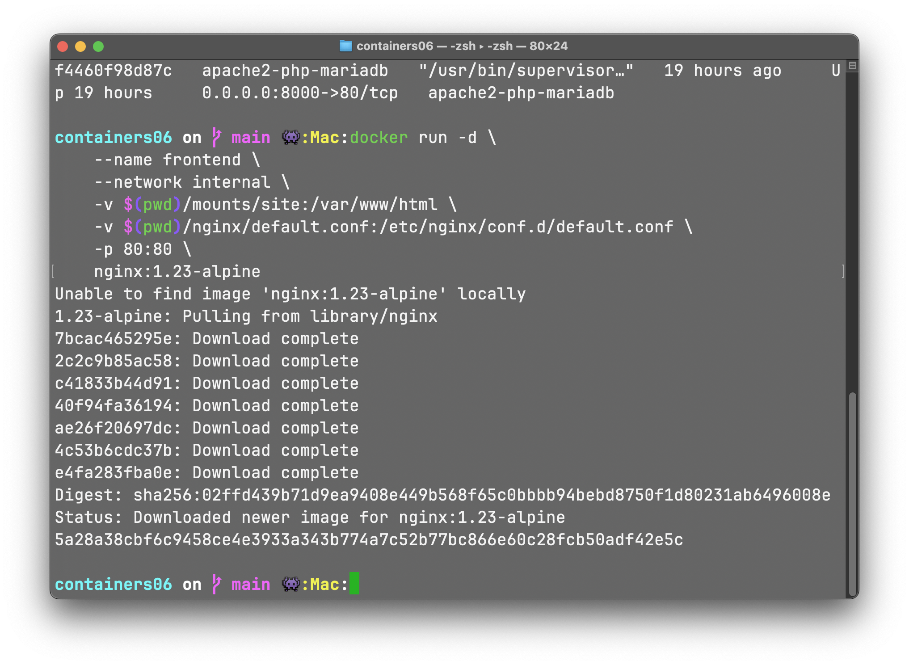  
     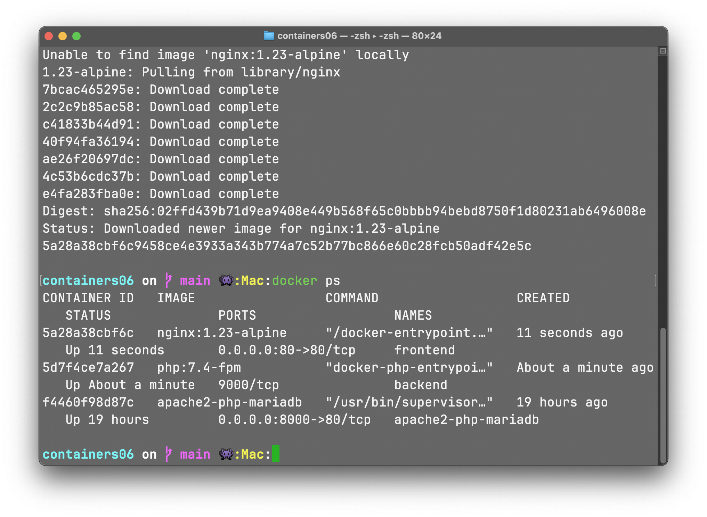  

#### Итог:  
Контейнер `frontend` обслуживает HTTP-запросы и связан с `backend`.  

---

### 7. Проверка работы сайта

#### Шаги:  
1. **Тест в браузере**:  
   - Открыл `http://localhost`.  
   - Если отображается стандартная страница Nginx, перезапустил:  
     ```bash
     docker restart frontend
     ```  

2. **Логи**:  
   - Проверил:  
     ```bash
     docker logs frontend
     docker logs backend
     ```  
   - **Скриншоты**:  
     - Логи `frontend`: 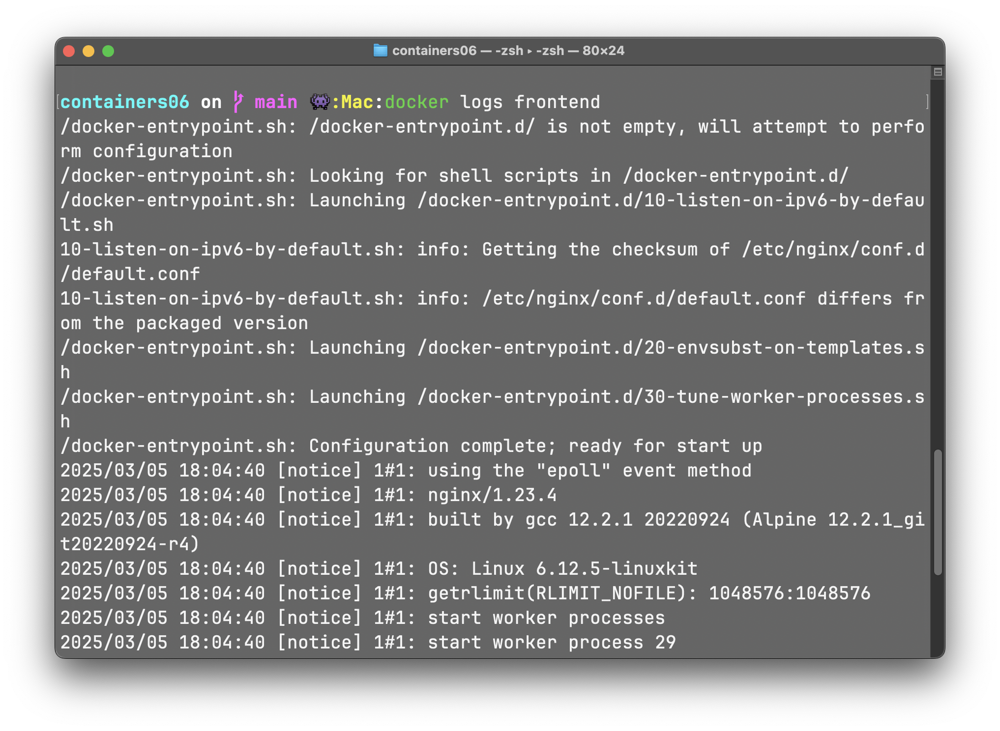  
     - Логи `backend`: 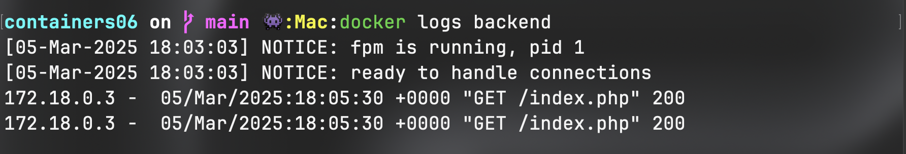  
     - Сайт: 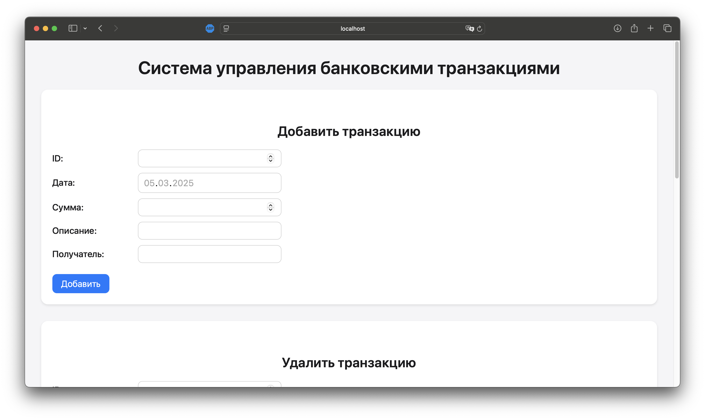
     - Сайт: 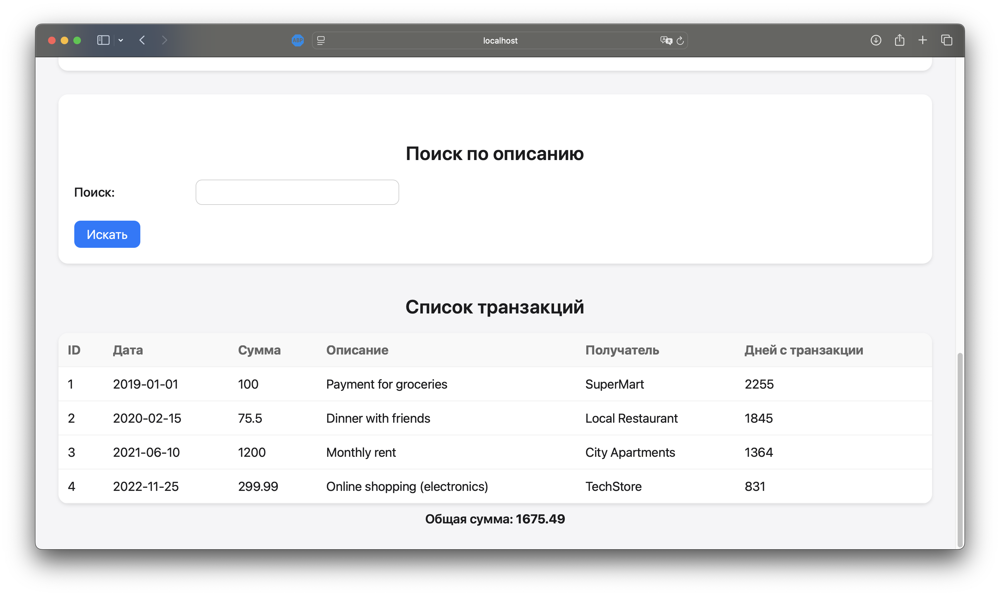
#### Итог:  
Сайт работает, Nginx передаёт PHP-запросы в PHP-FPM. 

---

## Ответы на вопросы

1. **Как контейнеры взаимодействуют?**  
   - Через сеть `internal`, где они обмениваются данными по именам контейнеров и портам (например, `backend:9000`).  

2. **Как видят друг друга в сети `internal`?**  
   - Docker автоматически присваивает DNS-имена (совпадают с `--name`), что позволяет `frontend` обращаться к `backend` по имени.  

3. **Зачем переопределять конфигурацию Nginx?**  
   - Стандартный Nginx не обрабатывает PHP. Новая конфигурация указывает передавать `.php`-файлы в `backend` через FastCGI.  

---

## Выводы

Развёрнуто PHP-приложение с использованием двух контейнеров:  
- `backend` (PHP-FPM) для выполнения PHP-кода.  
- `frontend` (Nginx) для обработки запросов.  
Контейнеры связаны через сеть `internal`, а монтирование позволяет обновлять сайт и конфигурацию без пересборки. Работа показала преимущества разделения сервисов в Docker.

---

## Источники

1. [Docker Docs](https://docs.docker.com/)  
2. [Nginx Docs](https://nginx.org/en/docs/)  
3. [PHP-FPM Docs](https://www.php.net/manual/en/install.fpm.php)  